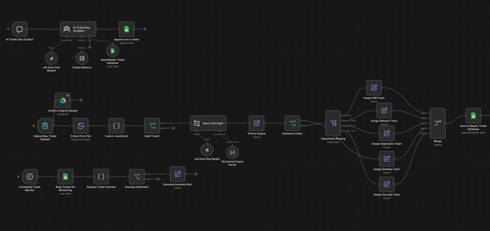
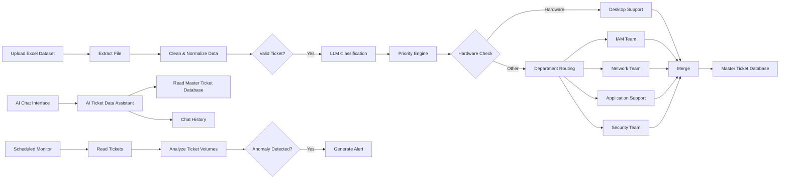

<div align="center">


**An end-to-end AI workflow for cleaning, classifying, prioritizing, routing, storing, monitoring, and querying IT service tickets.**

</div>

---

## Overview

This project is an AI-powered IT service-ticket automation system built in **n8n**. It takes an uploaded Excel ticket dataset, cleans and validates the data, uses an LLM to classify each ticket, applies priority logic, routes tickets to the appropriate support team, stores processed records in Google Sheets, and supports automated monitoring and conversational analysis.

The project was designed to reduce repetitive ticket triage work while keeping the workflow understandable, auditable, and easy to extend.

---

## Problem

Manual service-ticket triage can require teams to repeatedly:

- clean inconsistent ticket data
- identify missing or duplicate records
- determine the correct incident category
- assign priorities
- route tickets to the correct team
- maintain a centralized ticket database
- review ticket activity for unusual patterns
- answer questions about processed ticket data

This workflow combines those steps into one automated system.

---

## Solution

The workflow contains three connected capabilities:

### 1. Ticket Processing Pipeline
Processes uploaded Excel ticket data from ingestion through final storage.

### 2. AI Ticket Data Assistant
Provides a conversational interface for asking questions about processed ticket data.

### 3. Scheduled Ticket Monitor
Analyzes ticket volumes on a schedule and flags unusual activity based on defined thresholds.

---


## Workflow Preview

<div align="center">



<sub>Full n8n workflow showing ticket ingestion, data cleaning, LLM classification, priority logic, department routing, chatbot analysis, scheduled monitoring, and final storage.</sub>

</div>

---

## System Architecture



---

## Core Features

### Data Cleaning & Validation

The JavaScript preprocessing stage normalizes inconsistent values before tickets are sent to the AI classifier. It handles:

- whitespace and missing-value cleanup
- boolean normalization
- numeric normalization
- label formatting
- multiple date formats
- common ticket-description typos
- technical-name formatting such as VPN, Wi-Fi, CRM, MFA, and Salesforce
- missing ticket IDs
- missing descriptions
- duplicate ticket IDs

Only valid tickets continue through the main AI processing pipeline.

### AI Classification

The workflow uses an **xAI Grok model** through n8n's LLM tooling to classify tickets into one of five categories:

| Category | Example issues |
|---|---|
| Account Access | Passwords, login failures, account lockouts, permissions |
| Network Issue | VPN, Wi-Fi, internet connectivity, outages |
| Application Support | Software errors, CRM issues, application failures |
| Hardware Support | Laptops, monitors, docks, peripherals |
| Security Issue | Phishing, malware, suspicious activity, compromise |

The structured AI response includes the ticket ID, category, summary, confidence score, human-review signal, and rationale.

### Priority Engine

After classification, the workflow applies rule-based priority logic to identify higher-impact tickets. Security issues receive critical treatment, while outage and availability-related language is used to distinguish additional priority levels.

### Intelligent Team Routing

Tickets are automatically routed according to their classified issue type:

| Ticket Type | Assigned Team |
|---|---|
| Account Access | IAM Team |
| Network Issue | Network Team |
| Application Support | Application Support Team |
| Hardware Support | Desktop Support Team |
| Security Issue | Security Team |

### Centralized Ticket Storage

Processed tickets are merged into a consistent output structure and written to a Google Sheets master ticket database with fields such as:

- Ticket ID
- Description
- Requester
- Created Date
- Priority
- Category
- Assigned Team
- AI Confidence
- Human Review
- Summary
- Processed Date
- Status


### Sample Processed Output

A successful test run produced correctly structured records across all five routing categories:

| Ticket | Category | Priority | Assigned Team | AI Confidence |
|---|---|---:|---|---:|
| INC0019330 | Account Access | Low | IAM Team | 0.93 |
| INC0007913 | Network Issue | Low | Network Team | 0.74 |
| INC0024223 | Application Support | Medium | Application Support Team | 0.85 |
| INC0009728 | Hardware Support | Low | Desktop Support Team | 0.95 |
| INC0007176 | Security Issue | Critical | Security Team | 0.93 |

This test demonstrates the full classification-to-routing path, including the dedicated desktop-support path for hardware incidents and critical treatment for security incidents.

### AI Ticket Data Assistant

A separate chatbot workflow allows users to ask questions about processed ticket data. The assistant can use the master ticket database as a tool and is designed to answer questions about:

- ticket categories
- priorities
- assigned teams
- ticket counts
- common incident types
- recurring problems
- human-review tickets
- dataset trends

The workflow also includes short-term conversational memory and chat-history logging.

### Scheduled Anomaly Monitoring

A scheduled monitoring branch reads the ticket database, calculates ticket-volume indicators, and checks for unusual concentrations of:

- security incidents
- critical tickets
- human-review tickets
- network incidents

If defined thresholds are exceeded, the workflow generates an anomaly alert for review.

---

## Workflow Breakdown

```text
Excel Upload
   ↓
File Extraction
   ↓
JavaScript Cleaning & Validation
   ↓
Valid Ticket Check
   ↓
LLM Classification
   ↓
Structured Output
   ↓
Priority Engine
   ↓
Hardware Check / Department Routing
   ↓
Team Assignment
   ↓
Merge
   ↓
Google Sheets Master Database
```

---

## Technology Stack

| Technology | Purpose |
|---|---|
| **n8n** | Workflow orchestration and automation |
| **JavaScript** | Data cleaning, normalization, and monitoring logic |
| **xAI Grok** | LLM-based ticket classification and assistant reasoning |
| **Structured Output Parser** | Enforces consistent AI classification output |
| **Google Sheets** | Master ticket database and chat-history storage |
| **Google Drive** | Original dataset archiving |
| **Excel / XLSX** | Ticket dataset input |
| **n8n Memory** | Conversational context for the AI assistant |

---

## Example Processing Flow

A ticket such as:

```text
Ticket ID: INC-1042
Description: User cannot connect to company VPN.
Impact: 2 - Medium
Urgency: 2 - Medium
```

can move through the workflow as:

```text
Cleaned & validated
        ↓
Category: Network Issue
        ↓
Priority evaluated
        ↓
Assigned Team: Network Team
        ↓
Saved to Master Ticket Database
```

---

## Design Principles

The workflow was built around several practical ideas:

- **AI where judgment helps:** LLM classification is used for interpreting ticket descriptions.
- **Rules where consistency matters:** priority and routing logic remain deterministic.
- **Structured outputs:** AI responses follow a defined schema instead of free-form text.
- **Human oversight:** the classification schema includes confidence and review indicators for ambiguous or sensitive tickets.
- **Centralized data:** processed records are stored in one master location.
- **Automation beyond ingestion:** monitoring and conversational analysis extend the system after ticket processing.

---

## Repository Safety

The public portfolio version of this project should **not** contain live API keys, OAuth tokens, webhook identifiers, private spreadsheet IDs, private Drive folder IDs, or production ticket data.

Anyone importing a public workflow export should connect their own credentials and replace placeholder resource IDs before testing.

---

## Future Enhancements

Potential next steps include:

- email or Slack alerts for anomalies and critical incidents
- a dedicated human-review queue
- historical trend dashboards
- SLA-risk prediction
- richer confidence-based routing rules
- database-backed storage for higher ticket volumes
- role-based access controls
- model evaluation against a labeled ticket test set
- production observability and error handling

---

## About the Project

This project was created as an Information Systems automation project focused on applying **AI, workflow automation, data processing, and business-process design** to a realistic service-management use case.

<div align="center">

### Connect

<a href="https://www.linkedin.com/in/keyadhanani">

</a>

</div>
