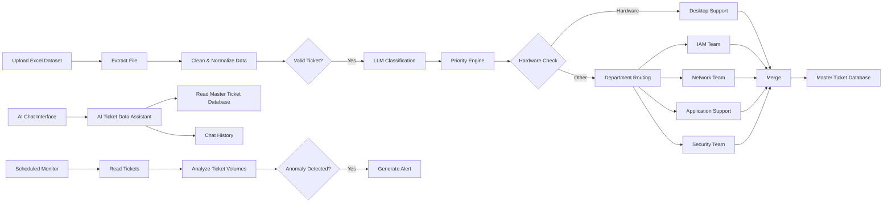
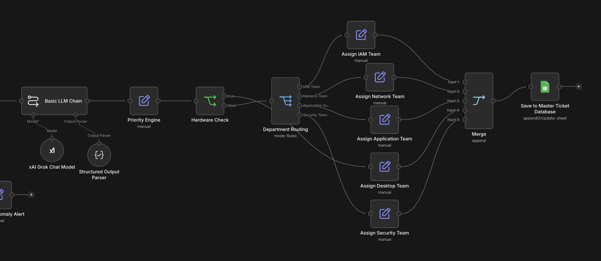
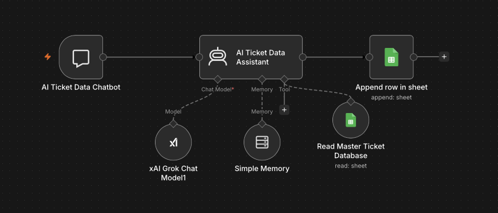
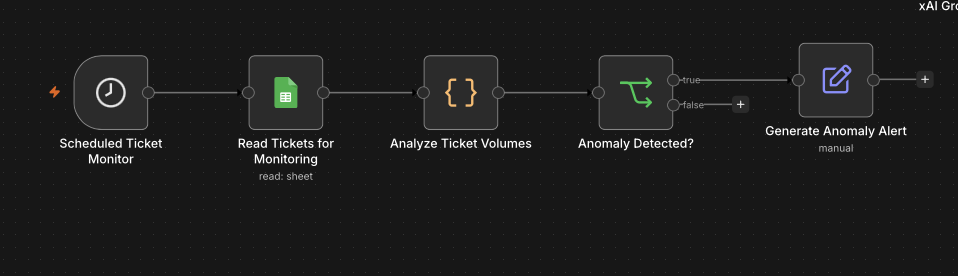

<div align="center">

# AI Ticket Automation

**End-to-End Intelligent IT Service Ticket Processing, Routing, Monitoring, and Analysis**


</div>

---

## Executive Summary

This project is an AI-powered IT service-ticket automation system built in **n8n**. The workflow accepts an uploaded Excel ticket dataset, cleans and validates the data, uses an LLM to classify each ticket, applies rule-based priority logic, routes tickets to the appropriate support team, stores processed records in Google Sheets, and supports automated monitoring and conversational analysis.

The system was designed to reduce repetitive ticket-triage work while keeping the workflow structured, auditable, and extensible.

---

## Business Problem

Manual IT service-ticket triage can require teams to repeatedly perform several time-consuming tasks:

- Clean inconsistent or incomplete ticket data
- Identify missing or duplicate records
- Determine the correct incident category
- Assign ticket priority
- Route tickets to the appropriate support team
- Maintain a centralized ticket database
- Monitor ticket activity for unusual patterns
- Answer questions about processed ticket data

This project consolidates those activities into a single automated workflow.

---

## Solution Overview

The solution contains three primary capabilities:

### 1. Ticket Processing Pipeline

Processes uploaded Excel ticket data from ingestion through final storage.

### 2. AI Ticket Data Assistant

Provides a conversational interface for querying processed ticket data.

### 3. Scheduled Ticket Monitor

Analyzes ticket volumes on a schedule and flags unusual activity based on defined thresholds.

---

## Workflow Overview

<div align="center">


<sub>Full workflow showing ticket ingestion, data cleaning, LLM classification, priority logic, department routing, chatbot analysis, scheduled monitoring, and final storage.</sub>

</div>

---

## System Architecture



---

## Functional Components

### Data Cleaning and Validation

The JavaScript preprocessing stage normalizes inconsistent values before tickets are sent to the AI classifier. It handles:

- Whitespace and missing-value cleanup
- Boolean normalization
- Numeric normalization
- Label formatting
- Multiple date formats
- Common ticket-description typos
- Technical-name formatting such as VPN, Wi-Fi, CRM, MFA, and Salesforce
- Missing ticket IDs
- Missing descriptions
- Duplicate ticket IDs

Only valid tickets continue through the main AI processing pipeline.

### AI Classification

The workflow uses an **xAI Grok model** through n8n's LLM tooling to classify tickets into one of five categories:

| Category | Typical Issues |
|---|---|
| Account Access | Passwords, login failures, account lockouts, permissions |
| Network Issue | VPN, Wi-Fi, internet connectivity, outages |
| Application Support | Software errors, CRM issues, application failures |
| Hardware Support | Laptops, monitors, docking stations, peripherals |
| Security Issue | Phishing, malware, suspicious activity, compromise |

The structured AI response includes the ticket ID, category, summary, confidence score, human-review indicator, and rationale.

### Priority Logic

After classification, the workflow applies deterministic priority rules. Security issues receive critical treatment, while outage and availability-related language is used to distinguish additional priority levels.

### Department Routing and Team Assignment

Tickets are automatically routed according to their classified issue type:

| Ticket Type | Assigned Team |
|---|---|
| Account Access | IAM Team |
| Network Issue | Network Team |
| Application Support | Application Support Team |
| Hardware Support | Desktop Support Team |
| Security Issue | Security Team |

<div align="center">



<sub>Routing stage showing priority handling, hardware detection, department routing, team assignment, merge, and final storage.</sub>

</div>

### Centralized Ticket Storage

Processed tickets are merged into a consistent output structure and written to a Google Sheets master ticket database containing fields such as:

- Ticket ID
- Description
- Requester
- Created Date
- Priority
- Category
- Assigned Team
- AI Confidence
- Human Review
- Summary
- Processed Date
- Status

### AI Ticket Data Assistant

<div align="center">



<sub>The assistant uses the Grok model, short-term memory, the master ticket database as a tool, and chat-history logging.</sub>

</div>

The chatbot can answer questions about:

- Ticket categories
- Priorities
- Assigned teams
- Ticket counts
- Common incident types
- Recurring problems
- Human-review tickets
- Dataset trends

The workflow also includes short-term conversational memory and chat-history logging.

### Scheduled Anomaly Monitoring

<div align="center">



<sub>Scheduled monitoring reads processed tickets, analyzes ticket volumes, evaluates anomaly thresholds, and generates an alert when review is required.</sub>

</div>

The monitoring branch evaluates concentrations of:

- Security incidents
- Critical tickets
- Human-review tickets
- Network incidents

If defined thresholds are exceeded, the workflow generates an anomaly alert.

---

## Sample Results

A successful test run produced correctly structured records across all five routing categories:

| Ticket | Category | Priority | Assigned Team | AI Confidence |
|---|---|---:|---|---:|
| INC0019330 | Account Access | Low | IAM Team | 0.93 |
| INC0007913 | Network Issue | Low | Network Team | 0.74 |
| INC0024223 | Application Support | Medium | Application Support Team | 0.85 |
| INC0009728 | Hardware Support | Low | Desktop Support Team | 0.95 |
| INC0007176 | Security Issue | Critical | Security Team | 0.93 |

This test demonstrates the complete classification-to-routing path, including the dedicated desktop-support path for hardware incidents and critical treatment for security incidents.

---

## Processing Sequence

```text
Excel Upload
   ↓
File Extraction
   ↓
JavaScript Cleaning & Validation
   ↓
Valid Ticket Check
   ↓
LLM Classification
   ↓
Structured Output
   ↓
Priority Engine
   ↓
Hardware Check / Department Routing
   ↓
Team Assignment
   ↓
Merge
   ↓
Google Sheets Master Database
```

---

## Technology Stack

| Technology | Purpose |
|---|---|
| **n8n** | Workflow orchestration and automation |
| **JavaScript** | Data cleaning, normalization, and monitoring logic |
| **xAI Grok** | LLM-based ticket classification and assistant reasoning |
| **Structured Output Parser** | Enforces consistent AI classification output |
| **Google Sheets** | Master ticket database and chat-history storage |
| **Google Drive** | Original dataset archiving |
| **Excel / XLSX** | Ticket dataset input |
| **n8n Memory** | Conversational context for the AI assistant |

---

## Design Principles

- **AI for interpretation:** LLM classification is used where natural-language judgment is useful.
- **Rules for consistency:** Priority and routing logic remain deterministic.
- **Structured outputs:** AI responses follow a defined schema rather than free-form text.
- **Human oversight:** Confidence and review indicators support ambiguous or sensitive cases.
- **Centralized data:** Processed records are maintained in a single master location.
- **Post-processing automation:** Monitoring and conversational analysis extend the system beyond initial ticket ingestion.

---

## Security and Public Repository Considerations

The public portfolio version of this project should not contain:

- Live API keys
- OAuth tokens
- Webhook identifiers
- Private spreadsheet IDs
- Private Google Drive folder IDs
- Production ticket data

Anyone importing a public workflow export should connect their own credentials and replace placeholder resource IDs before testing.

---

## Future Enhancements

Potential improvements include:

- Email or Slack alerts for anomalies and critical incidents
- A dedicated human-review queue
- Historical trend dashboards
- SLA-risk prediction
- Expanded confidence-based routing rules
- Database-backed storage for higher ticket volumes
- Role-based access controls
- Model evaluation against a labeled ticket test set
- Production observability and error handling

---

## Project Context

This project was created as an Information Systems automation project focused on applying **AI, workflow automation, data processing, and business-process design** to a realistic IT service-management use case.

<div align="center">

[LinkedIn](https://www.linkedin.com/in/keyadhanani)

</div>
